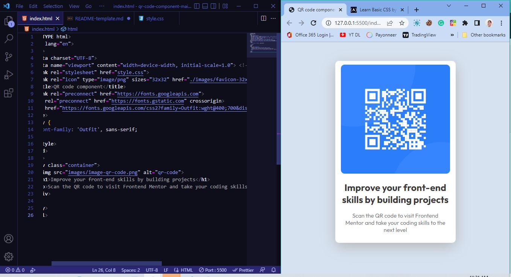

#  QR code component 

## Table of contents

- [Overview](#overview)
  - [Screenshot](#screenshot)
  - [My process](#my-process)
  - [Built with](#built-with)
  - [What I learned](#what-i-learned)
  - [Continued development](#continued-development)
  - [Useful resources](#useful-resources)

## Overview

The very first html css project I built with the help of frontend mentor.

### Screenshot

These are the screenshots of the qr code challenge I built.

## My process

So, Before I head and start coding, I took a look at the image of the design first and plan what would be the elements included in the html. 

Then, I basically head onto finishing the html first, next was I started custom design in CSS.

### Built with

- Semantic HTML5 markup
- CSS custom properties

### What I learned

Building this simple qr page for pros but hard for newbies like me is a great exercise to be frustrated yet improve my coding skills initially. 

This was such a fun experience because I learnt how to build this hopefully as close as to the original test image.

I didn't know how to add custom fonts, and use media query in vscode so I tried searching on youtube and articles to complete this challenge.

### Continued development

I am sure that I need to practice a lot more on the responsive design aspect and of course overall coding journey.

### Useful resources

I just realized that you don't need to create your own code by styling in css as their are free resources on internet like css generators to help you with drop shadows. Here is what I used for the drop shadow case: (https://www.cssmatic.com)

